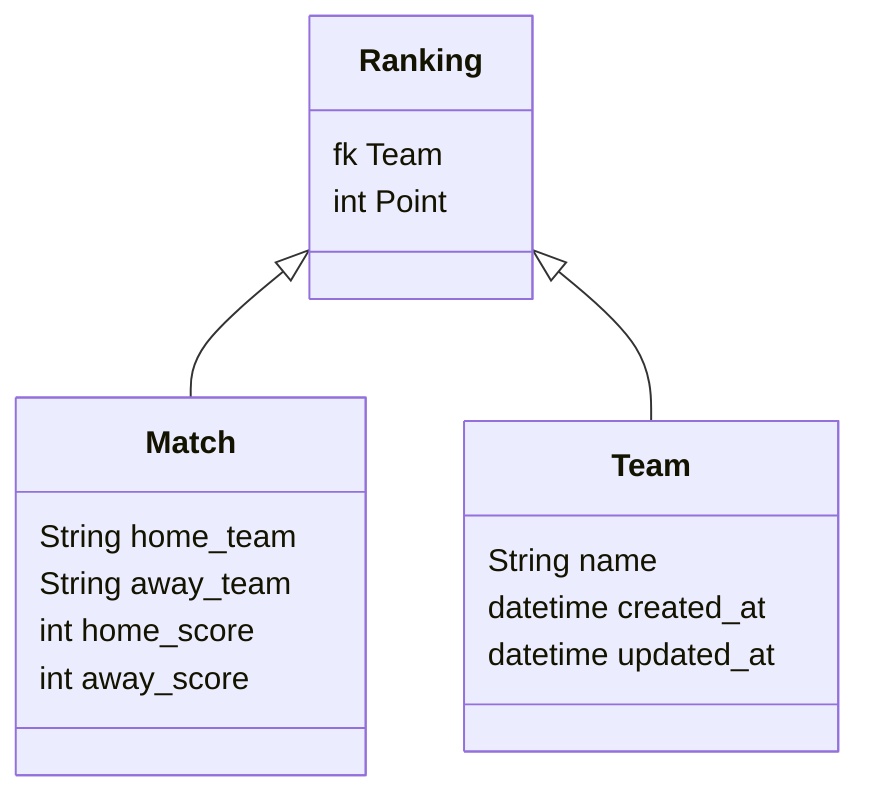

# Tigerlab assesment
Django Lab ranking asessement

## Setup coding environment
Programs needed:
- Code Editor
- Python 3.10
- `black` and `flake8`, and associated plugins in the code editor.

## Installation
* `git clone https://github.com/rajanazirul/tigerlab_assesment.git`
* `cd tigerlab_assesment/sports_app`
* `python -m venv venv`
* `source venv/bin/activate`
* `pip3 install -r requirements.txt`
- Setup local database by starting docker instances
* `cd ..`
* `docker-compose -f docker-compose.yml up -d`
- If not setup docker, can refer this link for [Docker](https://www.docker.com/get-started/) installation.
* `cd sports_app`
* `python3 manage.py migrate`
* `python3 manage.py createsuperuser`
* `python3 manage.py runserver`
* can visit http://localhost:8000/
- Please login using credential from `createsuperuser` command to upload csv file
- To Edit and Delete Games, can login through admin panel and use admin credential
* can visit http://localhost:8000/admin

## Run tests
* pytest -s

## Architecture
